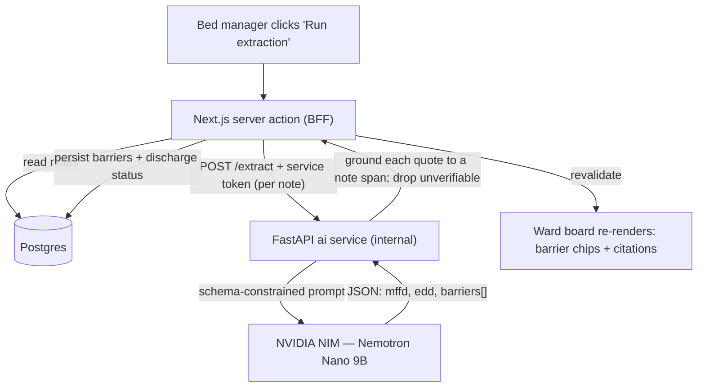

<div align="center">

# WardBeat

**A full-stack, AI-enabled application that helps keep a hospital ward flowing and beds utilised.**


</div>

---

> **Status: scaffolding.** This repository was just stood up from a proven
> full-stack platform (see [Foundations](#foundations)). No WardBeat feature
> logic has been written yet — the immediate work is process, structure, and a
> clean base. Product features are tracked as specs in [`specs/`](specs/README.md),
> starting with [0025 — WardBeat foundation](specs/0025-wardbeat-foundation.md).

## What it is

**WardBeat** is a clinical operations tool for hospital ward flow — helping
charge nurses and bed managers keep patients moving and beds utilised, with AI
assistance to surface bottlenecks and next-best actions. The problem space,
scope, and first slice of functionality are defined in
[spec 0025](specs/0025-wardbeat-foundation.md); this README documents the
platform WardBeat is built on and how to run and contribute to it.

## Foundations

WardBeat is built on an opinionated, batteries-included platform on **Next.js 16**
(App Router, RSC, Server Actions). Everything below is inherited, wired up, and
verified end to end — so product work starts from a proven base, not a blank page:

- 🔐 **Auth** via Auth.js v5 — email + password (Argon2id, JWT), plus opt-in **[GitHub & Google OAuth](docs/oauth.md)**; edge-protected routes
- ✉️ **[Password reset & email verification](docs/email.md)** — single-use hashed tokens, anti-enumeration, optional verify soft gate (opt-in with SMTP)
- 🧑‍⚖️ **Role-based access control** — roles on the JWT, edge + server guards, admin user-management, invite-based account claim
- 🗄️ **PostgreSQL + Drizzle ORM** — type-safe schema (see the **[ERD](docs/database.md#entity-relationship-diagram)**), committed migrations
- 📁 **File uploads** — self-hosted, S3-compatible object storage (MinIO), size/type validation, per-user quota
- 📱 **PWA + responsive app shell** — installable, offline-resilient, **[Web Push](docs/push.md)**, light/dark theming, mobile-to-desktop layout
- 🔎 **SEO** — OpenGraph/Twitter cards, `robots.txt` + `sitemap.xml`
- 💾 **[Automated backups](docs/backups.md)** — nightly Postgres + MinIO, doctor script, tested restore runbook
- 🧪 **Tested** — Vitest units + Playwright E2E
- 🐳 **Docker** — multi-stage, non-root production image
- 🛡️ **Strict TypeScript**, ESLint, Prettier, and pre-commit hooks

See **[Features](docs/features.md)** for the full inherited list.

> **CI/CD is intentionally deferred.** The GitHub Actions pipelines were removed
> for this stage — quality gates run **locally** (see [Contributing](#contributing)).
> The [CI/CD doc](docs/ci-cd.md) and [Feature → Production](docs/workflow.md)
> playbook describe the pipeline as it will be re-introduced later; they are
> reference, not the current wiring.

## How it works

WardBeat reads the ward's **free-text notes** and turns them into a live board of
**who is fit to leave and what's blocking them** — every finding traceable to the
sentence it came from. When a bed manager hits **Run extraction**:



1. **Read** — Next.js (the BFF) pulls each patient's notes from Postgres.
2. **Extract** — it sends each note to the internal **FastAPI** service, which prompts
   a small **NVIDIA NIM** model to return strict JSON `{ mffd, edd, barriers[] }`. The
   note is treated as data to read, never instructions to follow (prompt-injection
   defence).
3. **Ground** — FastAPI verifies every barrier's quoted evidence actually appears in the
   note, records the character span, and **drops anything it can't locate** — so the
   board only ever shows cited, real findings.
4. **Persist** — Next.js writes the structured barriers back to Postgres (Drizzle) and
   denormalises MFFD/EDD onto each encounter.
5. **Render** — the board refreshes; barrier chips are clickable to reveal the highlighted
   source sentence.

**Two runtimes, one front door:** the browser only ever talks to Next.js (UI, auth,
database); the Python **FastAPI** AI plane is internal-only, called server-side with a
shared token. Extraction runs on real NIM, or a deterministic **offline mock** (one env
flag) that also serves as the fallback if a live call fails — so the board never breaks.
Quality is measured, not assumed: `pnpm eval:extraction` scores barrier **F1** against
labelled ground truth (88% on live NIM, gate 0.85). Full design in the
**[PRD](docs/prd.md)**; run it via the **[demo runbook](docs/DEMO.md)**.

## Quick start

**Prerequisites:** Node 22 (see `.nvmrc`) · [pnpm](https://pnpm.io) (`corepack enable`) · Docker

```bash
# 1. Install
pnpm install

# 2. Configure environment
cp .env.example .env
npx auth secret            # generates AUTH_SECRET — paste into .env

# 3. Start Postgres + MinIO, apply schema, seed a demo user
pnpm docker:db
pnpm docker:minio
pnpm db:migrate
pnpm db:seed                # → demo@example.com / Password123

# 4. Run
pnpm dev                    # http://localhost:3000
```

Sign in with the demo account, or register a new one at `/register`.
For the installable PWA (service worker is production-only): `pnpm build && pnpm start`.

## Documentation

| Doc                                             | What's inside                                                          |
| ----------------------------------------------- | ---------------------------------------------------------------------- |
| 🖼️ **[One-pager](docs/onepager.html)**          | Single-page architecture & how-it-works brief (open in a browser)      |
| 🩺 **[PRD](docs/prd.md)**                       | Product vision, GenAI reference architecture (NVIDIA NIM), roadmap     |
| 📐 **[Specs](specs/README.md)**                 | Spec-driven development — WardBeat features + inherited platform specs |
| 📋 **[Features](docs/features.md)**             | Complete inherited feature list and what's included                    |
| 🏛️ **[Architecture](docs/architecture.md)**     | Request flow, auth design, security model, project structure           |
| 🗄️ **[Database](docs/database.md)**             | ERD, schema, migrations, Drizzle workflow, seeding                     |
| 🔑 **[OAuth](docs/oauth.md)**                   | GitHub + Google sign-in — setup, callback URLs, linking                |
| ✉️ **[Email](docs/email.md)**                   | SMTP setup, password reset, email verification, soft gate              |
| 📱 **[PWA & App Shell](docs/pwa.md)**           | Manifest, service worker strategy, icons, responsive shell             |
| 🔔 **[Web Push](docs/push.md)**                 | VAPID setup, subscribe/send, service-worker handlers                   |
| 🛠️ **[Usage & Development](docs/usage.md)**     | Scripts, env vars, testing, Docker, extending the app                  |
| 📦 **[Self-hosting](docs/self-hosting.md)**     | `make setup` clone-to-live + continuous deployment (`make deploy`)     |
| 🚀 **[Deployment](docs/deployment.md)**         | Cloudflare Tunnel — quick, guided, and Terraform paths                 |
| ⚙️ **[CI/CD](docs/ci-cd.md)**                   | Pipeline design (deferred — see the note above)                        |
| 🔁 **[Feature → Production](docs/workflow.md)** | One playbook: branch → PR → release → deploy                           |
| 💾 **[Backups](docs/backups.md)**               | Nightly Postgres + MinIO backups, restore runbook, offsite             |

## Development workflow

WardBeat follows **spec-driven, trunk-based development**:

1. **Spec first.** Non-trivial work starts with a spec — copy
   [`specs/TEMPLATE.md`](specs/TEMPLATE.md) to the next free `NNNN-slug.md`,
   open it as `Proposed`, and get to `Accepted` before building. See
   [`specs/README.md`](specs/README.md).
2. **Branch off `main`** as `feature/<slug>`. `main` is the only long-lived
   branch; a release is a `vX.Y.Z` tag on `main`.
3. **Conventional Commits**, enforced by a commitlint `commit-msg` hook; a
   `pre-commit` hook runs ESLint + Prettier on staged files.
4. **Open a PR into `main`** and run the local gate first (below).

Full detail: [CONTRIBUTING.md](CONTRIBUTING.md) and
[Feature → Production](docs/workflow.md).

## Scripts

Full reference — see **[Usage & Development](docs/usage.md)** for details.

| Command                              | What it does                                            |
| ------------------------------------ | ------------------------------------------------------- |
| `pnpm dev`                           | Start the dev server (Turbopack) at `localhost:3000`    |
| `pnpm build` · `pnpm start`          | Production build · serve the build                      |
| `pnpm lint` · `pnpm lint:fix`        | ESLint (check · autofix)                                |
| `pnpm typecheck`                     | Type-check with `tsc --noEmit`                          |
| `pnpm format` · `pnpm format:check`  | Prettier (write · check)                                |
| `pnpm test` · `pnpm test:watch`      | Unit tests (Vitest) — run once · watch                  |
| `pnpm test:e2e` · `pnpm test:e2e:ui` | End-to-end tests (Playwright) — headless · UI runner    |
| `pnpm db:generate`                   | Generate a SQL migration from the Drizzle schema        |
| `pnpm db:migrate`                    | Apply pending migrations                                |
| `pnpm db:studio`                     | Open Drizzle Studio (visual DB browser)                 |
| `pnpm db:seed`                       | Seed the demo admin + base roles (idempotent)           |
| `pnpm docker:db`                     | Start local Postgres                                    |
| `pnpm docker:minio`                  | Start local MinIO + one-shot bucket init                |
| `pnpm docker:mail`                   | Start local Mailpit (email catcher for the email E2E)   |
| `pnpm gen:icons` · `pnpm gen:og`     | Regenerate the PWA icon set · the OpenGraph share image |

## Tech stack

| Layer      | Choice                                                                         |
| ---------- | ------------------------------------------------------------------------------ |
| Framework  | Next.js 16 · React 19 · TypeScript 5.9 (strict)                                |
| Auth       | Auth.js (NextAuth) v5 — Credentials + GitHub/Google OAuth, JWT, Argon2id, RBAC |
| Email      | Optional SMTP via nodemailer — off by default, any provider                    |
| Database   | PostgreSQL 17 · Drizzle ORM + drizzle-kit                                      |
| Storage    | MinIO (S3-compatible) · @aws-sdk/client-s3                                     |
| UI         | Tailwind CSS v4 · shadcn/ui · lucide-react                                     |
| Validation | Zod (shared client/server schemas)                                             |
| Testing    | Vitest + Testing Library · Playwright (Mailpit for email)                      |
| Tooling    | ESLint (flat) · Prettier · Husky · lint-staged                                 |
| Delivery   | Multi-stage Docker (standalone, non-root) · Cloudflare Tunnel                  |

## Project structure

```
src/
├── app/            # App Router: (auth) + (dashboard) groups, api/ (incl. files/[id]), PWA manifest & offline
├── components/     # auth · files · push · pwa · settings · shell · theme · ui (shadcn)
├── db/             # Drizzle schema, client, migrate & seed scripts
├── lib/            # auth (config/actions/rbac/oauth/tokens/recovery), email, push, storage (S3/MinIO), shell/nav, validations, env
├── types/          # shared TypeScript types
└── proxy.ts        # edge route protection + role gating (Next 16 "proxy" convention)
```

Full tree and rationale in **[Architecture](docs/architecture.md)**.

## Deployment

WardBeat runs as a self-hosted Docker stack behind a **Cloudflare Tunnel** — no
open ports, no reverse proxy, no certs. Three on-ramps, all converging on the
same runtime:

- **Quick** — `make tunnel-quick` → an instant `https://<random>.trycloudflare.com` URL, no Cloudflare account.
- **Guided** — your domain, a tunnel token pasted from the Cloudflare dashboard.
- **Automated** — your domain, provisioned end-to-end by Terraform.

The guided path to all three, clone-to-live, is `make setup` — see
**[Self-hosting](docs/self-hosting.md)**. For per-command / Terraform
reference: **[Deployment](docs/deployment.md)**.

## Roadmap

**Inherited platform** (proven and in place):

- [x] Credentials auth · Drizzle/Postgres · Docker · PWA · responsive app shell
- [x] Auth rate limiting · nonce CSP + HSTS · structured-logging shim
- [x] RBAC · invite-based account claim · optional email delivery
- [x] File uploads & object storage · dark mode · SEO/OpenGraph · OAuth · Web Push
- [x] Cloudflare Tunnel deployment · automated backups

**WardBeat product** (planned — see [`specs/`](specs/README.md)):

- [x] Repository scaffold & development process ([0025](specs/0025-wardbeat-foundation.md))
- [x] Ward, bed, and patient-flow domain model ([v0.2.0](specs/releases/v0.2.0-barrier-intelligence-ward-board/spec.md))
- [x] Live ward board with AI-extracted, cited discharge barriers ([v0.2.0](specs/releases/v0.2.0-barrier-intelligence-ward-board/spec.md))
- [x] Natural-language flow copilot — ward-state Q&A + policy RAG ([v0.3.0](specs/releases/v0.3.0-flow-copilot/spec.md))
- [x] Action recommendations — agentic, policy-grounded, human-in-the-loop ([v0.4.0](specs/releases/v0.4.0-action-recommendations/spec.md))
- [ ] Forecasting & narration (LOS / demand) — v0.5.0

## Contributing

Commits run ESLint + Prettier via a Husky `pre-commit` hook. Before opening a PR,
run the full local gate (CI is deferred, so this is the gate that matters):

```bash
pnpm lint && pnpm typecheck && pnpm test && pnpm build
```

See **[CONTRIBUTING.md](CONTRIBUTING.md)** and **[Usage & Development](docs/usage.md)**
for the full workflow.

## License

Released under the [MIT License](LICENSE).
