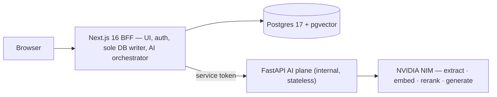

<div align="center">

# WardBeat

**A clinical-operations copilot for hospital ward flow — every bed, every barrier, every next action, in one place, explained.**


</div>

---

> **Status: shipping (v0.12.0).** The flow cockpit is live end to end: AI-extracted,
> cited discharge barriers with a full human lifecycle; a grounded copilot; policy-backed
> action recommendations a human approves; deterministic forecasting with AI narration;
> per-response AI provenance; ward-scoped RBAC and an append-only access audit. Runs
> entirely on **synthetic data**. Next up: [multi-ward](specs/releases/README.md).
> CI is deferred — quality gates run locally (see [Contributing](#contributing)).

## What it is

WardBeat is a live **flow cockpit** for a hospital ward. It reads the ward's
free-text nursing and ward-round notes with a small language model and turns
them into a board of **who is medically fit to leave and exactly what is
blocking them** — with every finding traceable to the sentence it came from.
On top of that board it layers a grounded natural-language copilot, an agent
that proposes the next-best action per barrier for a human to approve, and a
deterministic discharge/demand forecast that an LLM only narrates — never
computes.

It is explicitly **decision support, not autonomy**: nothing acts on external
systems, every AI claim is grounded or refused, and quality is measured by
eval harnesses with hard gates rather than asserted. The stack is
self-hostable containers (Next.js BFF + internal FastAPI AI plane over
[NVIDIA NIM](docs/ai-design.md)), so the same system can run on a trust's own
infrastructure and patient data never has to leave the network.

## The problems it solves

Hospitals lose bed capacity not because beds are physically full, but because
**flow stalls** — an information and coordination problem:

- **Invisible barriers.** A patient is fit for discharge but stuck on meds to
  take out, transport, a care package, or a review — and nobody has one
  current view of _why_.
- **Signal buried in prose.** Discharge dates, barriers, and escalations live
  in free-text notes, not structured fields. It's a reading problem, not a
  data-entry problem.
- **Reactive, not predictive.** Bed managers firefight at 2 pm on discharges
  that should have been planned that morning.
- **Nobody owns the chase.** A barrier with no owner, no due time, and no
  progress log is nobody's job.
- **AI that can't be trusted.** A tool that quietly invents a number or hides
  a fallback behind a "grounded" badge loses a ward's trust permanently — so
  WardBeat makes provenance, grounding, and honest omission first-class.

## Features

- **Live ward board** — every bed with status, estimated discharge date,
  fitness flag, and barrier chips; filter to the beds you could free today;
  barrier age and ownership at a glance.
- **AI barrier extraction** — schema-constrained extraction from notes with a
  grounding gate: every barrier must quote its source sentence or it's
  dropped. Prompt-injection defended; re-extraction never destroys human work.
- **Barrier lifecycle** — assign an owner and due time, keep a progress
  thread, clear with a reason, all on an append-only event log. Clinicians can
  add barriers the AI missed, durably dismiss ones it invented, and override
  the discharge date.
- **Flow copilot** — grounded Q&A over live ward state (validated structured
  filters — the model never authors a query) and trust discharge policy
  (pgvector RAG with reranking); cited answers or explicit refusals, with
  click-through to the referenced policy passage.
- **Action recommendations** — a policy-grounded agent proposes the next-best
  action per barrier; a human approves or dismisses, transactionally audited.
  Recommend-only, always.
- **Forecasting & briefing** — deterministic discharge probability and demand
  projection; an LLM narrates the numbers and is forbidden from inventing
  any. Figures that can't be computed honestly are omitted with a reason.
- **AI provenance & evals** — every AI response is labelled `live` / `mock` /
  `fallback` in the UI, and four eval harnesses (extraction F1 88%, gate
  0.85) refuse to print a score unless it came from a live model.
- **Ward RBAC & access audit** — clinical roles, ward membership, a
  fail-closed authorization check on every ward action, per-user AI rate
  limits, and an append-only audit of reads (who viewed which patient, who
  asked what) browsable at `/settings/audit`.
- **Production-grade platform** — Auth.js v5 (Argon2id, JWT, OAuth), Drizzle +
  Postgres 17 with committed migrations, MinIO object storage, web push,
  installable PWA with an auth-safe service worker, nightly backups with a
  tested restore runbook, and a one-command self-hosting path behind a
  Cloudflare Tunnel.

Full inventory: [Features](docs/features.md) · release history:
[CHANGELOG](CHANGELOG.md).

## How it works



Two runtimes, one front door: the browser only ever talks to Next.js; the
Python AI plane is internal-only and stateless. Every model call is
rate-limited, timeout-bounded, schema-validated on both sides, grounded
against its source, and stamped with provenance — and the whole system runs
offline on deterministic mocks with a single env flag (`NIM_MOCK`). The full
design, guardrails, and model choices are in **[AI design](docs/ai-design.md)**.

## Quick start

**Prerequisites:** Node 22 (`.nvmrc`) · pnpm 11 (`corepack enable`) · Docker
with Compose v2.

```bash
pnpm install
cp .env.example .env
npx auth secret                 # paste the value into AUTH_SECRET in .env

docker compose up -d db ai      # Postgres (pgvector) + the AI plane (offline mock mode)
pnpm docker:minio               # object storage (profile photos / uploads)

pnpm db:migrate
pnpm db:seed                    # demo@example.com / Password123 (admin)
pnpm db:seed:ward               # demo ward — 16 beds, notes with barriers
pnpm db:seed:policy             # discharge-policy KB (requires the ai service)

pnpm dev                        # http://localhost:3000
```

Sign in as the demo admin, open the board, and hit **Run extraction** — or
follow the **[demo runbook](docs/DEMO.md)** for the full walkthrough. To use
real models instead of the offline mocks, set `NIM_MOCK=false` and an
`NVIDIA_API_KEY`, then recreate the `ai` container. Environment reference and
all scripts: [Usage & Development](docs/usage.md).

## Documentation

| Area             | Docs                                                                                                                                                                                          |
| ---------------- | --------------------------------------------------------------------------------------------------------------------------------------------------------------------------------------------- |
| **Product**      | [PRD](docs/prd.md) · [Features](docs/features.md) · [Demo runbook](docs/DEMO.md) · [Explaining WardBeat](docs/explaining-wardbeat.md) · [Roadmap](docs/roadmap.md) · in-app guide at `/about` |
| **AI**           | [AI design](docs/ai-design.md) · [Evals](docs/evals.md) · [Monitoring](docs/monitoring.md) · [AI plane service reference](ai/README.md)                                                       |
| **Architecture** | [Architecture](docs/architecture.md) · [Database](docs/database.md) · [Security policy](SECURITY.md)                                                                                          |
| **Platform**     | [Usage & Development](docs/usage.md) · [PWA & app shell](docs/pwa.md) · [Web push](docs/push.md) · [OAuth](docs/oauth.md) · [Email](docs/email.md)                                            |
| **Operations**   | [Self-hosting](docs/self-hosting.md) · [Deployment](docs/deployment.md) · [Backups](docs/backups.md) · [CI/CD](docs/ci-cd.md) _(deferred — reference design)_                                 |
| **Process**      | [Specs](specs/README.md) · [Feature → Production](docs/workflow.md) · [CONTRIBUTING](CONTRIBUTING.md) · [CHANGELOG](CHANGELOG.md)                                                             |

## Tech stack

| Layer    | Choice                                                                                      |
| -------- | ------------------------------------------------------------------------------------------- |
| Web      | Next.js 16 (App Router, RSC, Server Actions) · React 19 · TypeScript 5.9 strict             |
| AI plane | FastAPI (Python 3.12) · NVIDIA NIM — Nemotron Nano 9B, NV-EmbedQA-E5-v5, Llama-3.2 RerankQA |
| Database | PostgreSQL 17 + pgvector · Drizzle ORM (committed migrations)                               |
| Auth     | Auth.js v5 — credentials (Argon2id, JWT) + GitHub/Google OAuth · ward RBAC                  |
| UI       | Tailwind CSS v4 · shadcn/ui · installable PWA                                               |
| Storage  | MinIO (S3-compatible)                                                                       |
| Testing  | Vitest · Playwright (+ axe a11y) · pytest · four AI eval harnesses                          |
| Delivery | Multi-stage non-root Docker · Cloudflare Tunnel (no open ports)                             |

## Deployment

Self-hosted Docker behind a **Cloudflare Tunnel** — no open ports, no reverse
proxy, no certs. `make setup` is the clone-to-live wizard with three on-ramps
(instant `trycloudflare.com` URL, guided with your own domain, or fully
Terraform-provisioned), and `make deploy` handles continuous pull-based
deploys. See [Self-hosting](docs/self-hosting.md) and
[Deployment](docs/deployment.md).

## Contributing

Spec-driven, trunk-based: non-trivial work starts with a spec in
[`specs/releases/`](specs/releases/README.md), branches off `main`, and lands
by PR with Conventional Commits (hook-enforced). CI is deferred, so the local
gate is the gate that matters:

```bash
pnpm lint && pnpm typecheck && pnpm test && pnpm build
```

Full workflow: [CONTRIBUTING.md](CONTRIBUTING.md) ·
[Feature → Production](docs/workflow.md).

## License

Released under the [MIT License](LICENSE).
