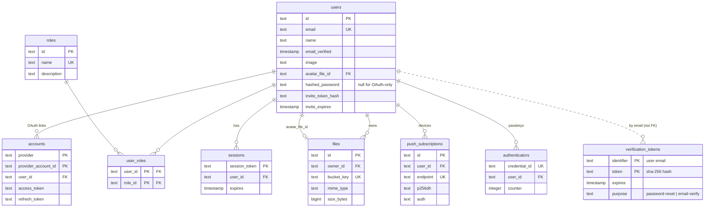
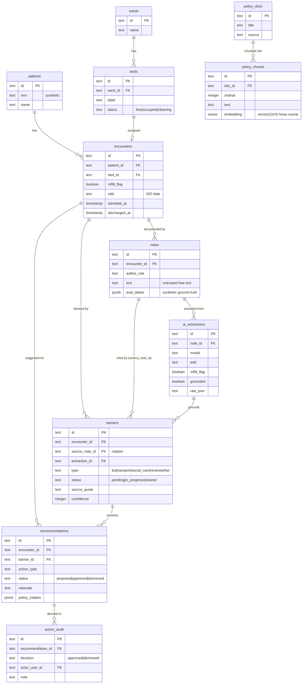

# Database

[← Back to README](../README.md)

PostgreSQL 17 (with the **pgvector** extension) accessed through
[Drizzle ORM](https://orm.drizzle.team) with a `postgres-js` driver. Next.js is the
**single writer** — the FastAPI AI plane is stateless and never touches the database.
Schema splits into the inherited **platform** tables (auth, files, push) and the
**WardBeat** tables (ward domain, AI outputs, policy KB).

### Entity-Relationship Diagram



#### WardBeat domain



### Schema Tables

**Platform (inherited):**

| Table                 | Purpose                                                   |
| --------------------- | --------------------------------------------------------- |
| `users`               | Accounts with password, email, invites, avatar            |
| `accounts`            | OAuth provider links (GitHub/Google)                      |
| `sessions`            | Database sessions (unused under JWT strategy)             |
| `verification_tokens` | Single-use tokens for password reset & email verification |
| `authenticators`      | WebAuthn/passkey credentials                              |
| `roles`               | Roles: admin, member, viewer                              |
| `user_roles`          | Many-to-many users ↔ roles                                |
| `files`               | Uploaded file metadata + S3 storage                       |
| `push_subscriptions`  | Web Push subscriptions per device                         |

**WardBeat — ward domain:**

| Table        | Purpose                                                   |
| ------------ | --------------------------------------------------------- |
| `wards`      | A hospital ward                                           |
| `patients`   | Synthetic patients (MRN + name — never real PHI)          |
| `beds`       | Beds in a ward with a `free`/`occupied`/`cleaning` status |
| `encounters` | A patient's stay: bed, `admitted_at`, `edd`, `mffd_flag`  |
| `notes`      | Free-text clinical notes on an encounter (the AI input)   |

**WardBeat — AI outputs:**

| Table             | Purpose                                                                                                         |
| ----------------- | --------------------------------------------------------------------------------------------------------------- |
| `ai_extractions`  | Per-note extraction result (EDD, MFFD, escalations, raw JSON)                                                   |
| `barriers`        | Discharge blockers (`tto`/`transport`/`social_care`/`review`/`other`) with a **cited source note + quote/span** |
| `recommendations` | Recommend-only next-best actions, each with a policy citation                                                   |
| `action_audit`    | Human approve/dismiss decisions on recommendations (who + when)                                                 |

**WardBeat — policy knowledge base (RAG):**

| Table           | Purpose                                                                                  |
| --------------- | ---------------------------------------------------------------------------------------- |
| `policy_docs`   | Discharge-policy source documents                                                        |
| `policy_chunks` | Chunked text with a `vector(1024)` **pgvector** embedding + an **hnsw cosine** ANN index |

> The **pgvector** extension backs `policy_chunks.embedding` (1024-dim, matching the
> `nv-embedqa-e5-v5` embedding model), searched via an hnsw cosine-similarity index for
> the copilot's policy retrieval. Next.js is the sole writer to every table above.

### Migration Workflow

```bash
pnpm db:generate    # generates SQL migration
pnpm db:migrate     # applies pending migrations
pnpm db:push        # direct schema push (prototyping)
pnpm db:studio      # visual DB browser
```

**Key files:**

- `src/db/migrate.ts:23` - Migration runner (Docker entrypoint)
- `src/db/seed.ts` - Idempotent seed (roles admin/member/viewer + demo admin user)

### Important Features

#### Role-Based Access Control

- Roles carried as `roles: string[]` claim on JWT (no DB round-trip to read)
- Edge gating via `proxy.ts`
- Server-side guards in `src/lib/auth/rbac.ts`

#### File Storage

- MinIO (S3-compatible) for object storage
- Postgres `files` table for metadata
- Ownership-checked downloads
- Profile photos support via `users.avatar_file_id`

#### Security Features

- Passwords stored with Argon2id
- Email uniqueness enforced (case-insensitive)
- Verification tokens stored as SHA-256 hashes
- Invite-based account claim (passwordless)

### Database Commands

| Command               | Description                                                               |
| --------------------- | ------------------------------------------------------------------------- |
| `pnpm docker:db`      | Start local Postgres (pgvector/pg17 image)                                |
| `pnpm docker:minio`   | Start local MinIO with bucket                                             |
| `pnpm db:migrate`     | Apply migrations                                                          |
| `pnpm db:seed`        | Seed demo user (`demo@example.com` / `Password123` )                      |
| `pnpm db:seed:ward`   | Seed synthetic wards, beds, patients, encounters, and notes               |
| `pnpm db:seed:policy` | Seed discharge-policy docs and embed their chunks (via the AI plane)      |
| `pnpm db:extract`     | Run barrier extraction over seeded notes and persist extractions/barriers |
| `pnpm db:recommend`   | Run the recommendation agent over open barriers and persist proposals     |

### Production Setup

See [deployment.md](deployment.md) for production Docker configuration.
