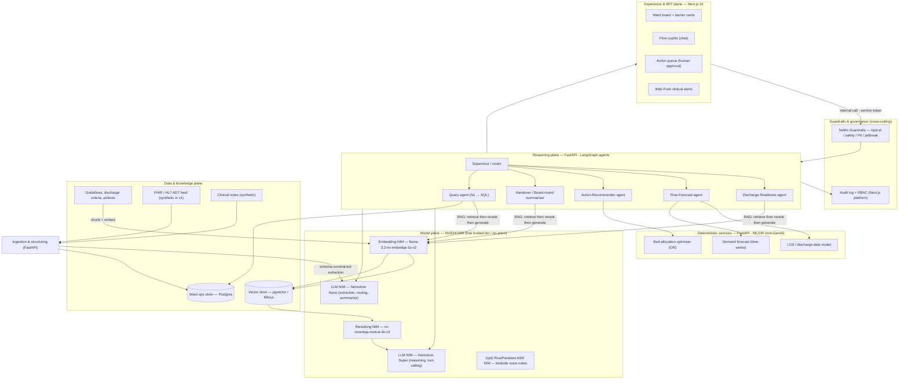
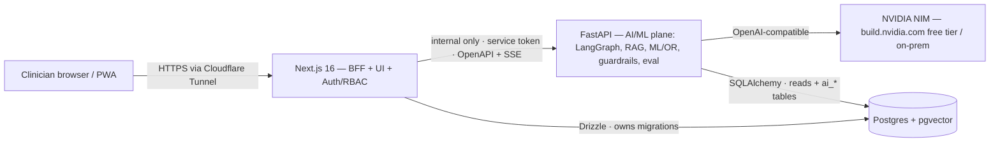

# WardBeat — Product Requirements Document

[← Back to README](../README.md)

|                    |                                                                                                                                        |
| ------------------ | -------------------------------------------------------------------------------------------------------------------------------------- |
| **Status**         | Draft (v0.1)                                                                                                                           |
| **Owner**          | Daniel                                                                                                                                 |
| **Last updated**   | 2026-07-27                                                                                                                             |
| **Type**           | Portfolio project — showcase of generative-AI solution architecture                                                                    |
| **Companion spec** | [`specs/releases/v0.2.0-barrier-intelligence-ward-board/`](../specs/releases/v0.2.0-barrier-intelligence-ward-board/spec.md) (Phase 1) |

---

## 0. TL;DR

WardBeat is a **clinical-operations copilot that helps a hospital ward run at full,
safe bed utilisation**. It ingests the messy, mostly-unstructured signals of ward
life — nursing notes, ward-round entries, ADT feeds, discharge criteria — and uses
**generative AI to turn them into structured, explained, actionable insight**: who
is medically fit for discharge and what's blocking them, where the flow bottlenecks
are, and what the next best action is.

The point of the project is **architectural**: it demonstrates a modern, defensible
GenAI topology — **RAG done properly, agentic orchestration with human-in-the-loop,
guardrails, and an honest split between generative and predictive components** — served
on **NVIDIA NIM microservices** so the whole stack can run **on-prem inside a hospital's
own GPUs**, which is the deciding factor for healthcare data.

> **Safety framing (read this first).** WardBeat is a **decision-support** tool. It
> **recommends and drafts; clinicians decide**. No model takes an autonomous clinical
> action. Every AI output is grounded, cited, and reversible. This constraint shapes
> the entire architecture below.

---

## 1. Problem & context

Hospital wards lose bed capacity not because beds are physically full, but because
**patient flow stalls**. The recurring failure modes:

- **Invisible discharge barriers.** A patient is medically fit for discharge (MFFD) but
  stuck waiting on a TTO (to-take-out meds), transport, a social-care package, or a
  specialist review — and nobody has a single, current view of _why_.
- **Signal buried in prose.** The status that matters (EDD — estimated discharge date,
  barriers, escalations) lives in **free-text notes**, not structured fields.
- **Reactive, not predictive.** Bed managers firefight at 2pm when the discharge should
  have been planned that morning. "Discharge before noon" targets are routinely missed.
- **High-friction coordination.** Board rounds and handovers are prepared by hand from
  scattered systems, eating clinical time.

The result: **delayed transfers of care (DTOC), long lengths of stay (LOS), cancelled
admissions, and ambulances queuing** — a capacity problem that is really an
**information and coordination problem**. That is exactly the shape of problem modern
GenAI is good at.

---

## 2. Vision & positioning

> **"A live heartbeat for the ward — every bed, every barrier, every next action, in one
> place, explained."**

WardBeat is **not** an EHR and **not** an autonomous agent. It is a thin, intelligent
layer _on top of_ existing systems that (a) makes ward state legible in real time and
(b) uses generative reasoning to compress the cognitive load of running flow.

**Design intent.** The scope is deliberately chosen to demonstrate five things:

1. Choose the **right GenAI pattern for each job** (and say where an LLM is the _wrong_
   tool).
2. Build **production-grade RAG** with retrieval quality controls and evaluation.
3. Design **agentic workflows** with tool use and human-in-the-loop checkpoints.
4. Treat **safety, guardrails, and governance** as first-class, not bolt-ons.
5. Make a **deployment argument** — why NVIDIA NIM and on-prem inference is the correct
   call for healthcare, with a hosted-to-self-hosted migration path.

---

## 3. Goals, non-goals & success metrics

### Goals

- Surface, in real time, **which patients are MFFD and what's blocking each discharge**,
  extracted from unstructured notes with citations back to the source text.
- Give bed managers a **natural-language copilot** over live ward state ("show me every
  medical outlier waiting on transport").
- **Forecast** ward-level demand and per-patient discharge dates, and **narrate** those
  forecasts in plain language.
- **Auto-draft** board-round briefings and SBAR handovers.
- **Recommend** next-best actions with a one-click, audited human approval step.

### Non-goals (v1)

- Autonomous clinical decisions or actions. (Recommend-only, always.)
- Replacing the EHR, PAS, or bed-management system of record.
- Diagnosis, triage, or any regulated medical-device function (see §12).
- Real patient data — v1 runs entirely on **synthetic** data (see §9).

### Success metrics

| Layer                  | Metric                                          | Target (illustrative) |
| ---------------------- | ----------------------------------------------- | --------------------- |
| **Product / clinical** | Time to identify MFFD-but-delayed patients      | minutes → seconds     |
|                        | Discharge-before-noon rate                      | measurable uplift     |
|                        | Board-round prep time                           | −70%                  |
|                        | Bed utilisation vs safe ceiling                 | closer to target      |
| **AI quality**         | RAG groundedness / faithfulness (RAGAS)         | ≥ 0.9                 |
|                        | Barrier-extraction F1 vs labelled synthetic set | ≥ 0.85                |
|                        | Guardrail catch rate on red-team prompts        | ≥ 0.98                |
| **System**             | p95 copilot latency                             | < 3 s                 |
|                        | Cost / 1k processed notes                       | tracked & tiered      |

---

## 4. Personas & jobs-to-be-done

| Persona                        | Job-to-be-done                                                | WardBeat surface                   |
| ------------------------------ | ------------------------------------------------------------- | ---------------------------------- |
| **Bed / flow manager**         | "Free the right beds by noon, safely."                        | Ward board, copilot, action queue  |
| **Charge nurse**               | "Know each patient's barrier without re-reading every note."  | Per-patient barrier cards          |
| **Discharge coordinator**      | "Chase TTOs, transport, social care before they block a bed." | Action recommendations             |
| **Site / operations manager**  | "See house-wide flow risk for the next 12–24h."               | Forecast dashboard, narrated brief |
| **Clinical lead (governance)** | "Trust that AI is grounded, audited, and safe."               | Citations, audit log, eval reports |

---

## 5. Where generative AI earns its place

The single most important design decision — and the one most worth scrutinising — is
**not using an LLM for everything**. WardBeat splits the work by tool-fit:

| Task                                             | Right tool                                | Why                                                                       |
| ------------------------------------------------ | ----------------------------------------- | ------------------------------------------------------------------------- |
| Extract barriers/EDD from free-text notes        | **GenAI (LLM extraction)**                | Unstructured → structured; schema-constrained JSON output                 |
| Answer NL questions over ward state              | **GenAI (RAG + text-to-SQL)**             | Language understanding + grounded synthesis                               |
| Draft handovers / board-round briefs             | **GenAI (summarisation)**                 | Fluent, structured compression of many sources                            |
| Reason over heterogeneous signals & plan actions | **GenAI (agent + tool use)**              | Multi-step orchestration, tool calling                                    |
| Predict length-of-stay / discharge date          | **Classical/predictive ML**               | Tabular forecasting — LLMs are weak, expensive, and unaccountable at this |
| Forecast admission demand                        | **Time-series ML**                        | Same reason; needs calibrated uncertainty                                 |
| Optimise bed allocation                          | **Operations research (MILP/heuristics)** | Constraint optimisation, not text generation                              |
| Generate realistic test data                     | **GenAI + Synthea**                       | Synthetic notes/scenarios without PHI                                     |

> **The headline:** _GenAI is the reasoning, language, and glue layer;
> deterministic ML/OR does the forecasting and optimisation; the LLM explains and
> orchestrates them._ Using an LLM to "predict a number" or "optimise" is an
> anti-pattern I'm explicitly avoiding.

---

## 6. Capabilities (product scope)

- **E1 — Live ward board.** Real-time bed map with per-patient status, EDD, and barrier
  chips, each traceable to its source note.
- **E2 — Barrier intelligence.** Continuous extraction of discharge barriers and EDD
  signals from incoming notes, normalised to a schema.
- **E3 — Flow copilot.** Natural-language Q&A over live ward state with grounded answers
  and drill-down citations.
- **E4 — Forecast & narrate.** Per-patient discharge-date and ward-level demand
  forecasts, explained in prose with confidence.
- **E5 — Action recommendations.** Next-best actions (chase TTO, book transport,
  escalate), queued for one-click human approval and audited.
- **E6 — Auto-briefings.** Generated board-round brief and SBAR handover.
- **E7 — Governance.** Citations, audit trail, guardrail reports, evaluation dashboard.

---

## 7. Generative AI reference architecture (topology)

Five planes. GenAI concentrates in **Structuring**, **Retrieval**, and **Reasoning**;
deterministic services sit alongside; everything is wrapped in guardrails and
observability.

> **Engineering approach: harness engineering, not prompt engineering.** WardBeat
> treats each model as an **unreliable, stochastic component** and engineers
> reliability _around_ it. The value is in the **harness** — structured/constrained
> I/O, retrieval and context assembly, tool orchestration, guardrails, verification
> and retry loops, and an evaluation harness that gates changes — not in a clever
> prompt. A prompt tweak is unversioned and brittle; a harness is testable,
> observable, and improves monotonically. Everything below (§7.1–§7.8) is a harness
> component; the prompt is the smallest, least interesting part.



### 7.1 Data & knowledge plane

- **Ward ops store** = the **Postgres already in the scaffold** (reuse). Holds normalised
  ward/bed/patient/barrier state.
- **Vector store** = **pgvector** on that same Postgres for the MVP (one fewer moving
  part, transactional consistency with ops data); graduate to **Milvus** if corpus/QPS
  grows.
- **Knowledge base** = discharge criteria, trust discharge policy, escalation SOPs,
  medicines-optimisation guidance — the corpus RAG grounds against.
- **Feed** = FHIR R4 / HL7v2 **ADT** (admit/discharge/transfer) events + clinical notes.
  In v1 these are **synthetic** (§9).

### 7.2 Ingestion & structuring (GenAI extraction)

Incoming notes are passed to a **small, fast LLM NIM (Nemotron Nano)** with a
**schema-constrained (JSON / function-calling) prompt** that extracts: `barriers[]`,
`edd`, `mffd_flag`, `escalations[]`, each with a **span citation** back to the source
text. This is the highest-volume LLM workload, so it runs on the cheapest capable model
(model tiering, §7.9). Output lands in the ops store as structured, queryable state.

### 7.3 Retrieval (RAG via NeMo Retriever)

Grounded answers and policy-aware reasoning use the canonical **NeMo Retriever pipeline**:

```
Query → Embedding NIM → ANN search (top-K) → Reranking NIM → top-N cited passages → LLM
```

- **Embedding NIM:** `llama-3.2-nv-embedqa-1b-v2` (Matryoshka-configurable dims — tune
  the recall/cost trade-off) or `nv-embedqa-e5-v5` (1024-d) as a lighter alternative.
- **Reranking NIM:** `nv-rerankqa-mistral-4b-v3` (or `llama-3.2-nv-rerankqa-1b-v2`) —
  **citation-aware reranking is what buys groundedness**; embeddings alone retrieve
  "related," reranking retrieves "relevant." I call this out because naive RAG that skips
  reranking is the most common quality failure.
- Answers always carry **inline citations**; ungrounded generation is blocked by
  guardrails and caught by the eval harness.

### 7.4 Reasoning plane (agentic orchestration)

Orchestrated with **LangGraph** (stateful graph, explicit **human-in-the-loop
checkpoints**, retries, and durable state) against NIM's **OpenAI-compatible** endpoints:

- **Supervisor / router** — classifies the request and dispatches to the right agent;
  cheap model.
- **Discharge-Readiness agent** — for each patient, reconciles extracted barriers against
  discharge criteria (RAG) → MFFD verdict + explanation.
- **Flow-Forecast agent** — **calls the deterministic LOS/demand services as tools** and
  narrates the numbers (it does _not_ compute them).
- **Action-Recommender agent** — proposes next-best actions; **every action is a draft
  requiring human approval** before anything leaves WardBeat.
- **Handover / Board-round summariser** — generates SBAR + board brief from ops state.
- **Query agent** — **NL → parameterised SQL** over the ops store (read-only, allow-listed
  columns) for the copilot.

Tool-calling and multi-step planning run on **Nemotron Super** (agentic reasoning, long
context, tool use); routing/extraction/summarising run on **Nemotron Nano**.

### 7.5 Deterministic services (deliberately _not_ GenAI)

- **LOS / discharge-date model** — gradient-boosted / tabular model on admission features.
- **Demand forecast** — time-series model with calibrated intervals.
- **Bed-allocation optimiser** — OR/MILP or heuristic under capacity/isolation
  constraints.

These expose plain APIs the agents call as tools. **Separation of concerns is the point:
accountable, testable numbers from deterministic code; language and reasoning from GenAI.**

### 7.6 Experience plane

The **already-scaffolded Next.js 16 app**: server components + server actions, the
responsive app shell, **RBAC**, and **Web Push** (→ clinical alerts when a bed frees or a
barrier clears). The copilot is a streaming chat over the reasoning plane; the action
queue is the human-in-the-loop UI.

### 7.7 Safety, guardrails & governance

- **NeMo Guardrails** wraps every LLM I/O: **topical rails** (stay on ward-ops), **safety
  rails** (no clinical advice/diagnosis), **PII rails** (redaction), **jailbreak/injection**
  defence — critical because notes are untrusted input (prompt-injection surface).
- **Groundedness gate:** answers without sufficient retrieved support are refused, not
  hallucinated.
- **Audit + RBAC** reuse the platform's controls; every AI output and every approved
  action is logged with its sources and the approving user.

### 7.8 LLMOps — evaluation & observability

- **Tracing:** Langfuse (or NeMo-native) spans across agents/tools — latency, tokens, cost.
- **RAG eval:** **RAGAS** — faithfulness, context precision/recall, answer relevancy —
  run in CI against a labelled synthetic set.
- **Agent/action eval:** **LLM-as-judge** rubric for action quality + task-completion
  checks.
- **Safety eval:** red-team prompt suite (injection, PII exfil, out-of-scope) with a pass
  gate.
- **Regression:** golden datasets so a model/prompt swap can't silently degrade quality.

### 7.9 Model routing / tiering

| Function                                        | NIM model                      | Why this tier                              |
| ----------------------------------------------- | ------------------------------ | ------------------------------------------ |
| High-volume note extraction, routing, summarise | **Nemotron Nano**              | Cheapest capable; latency + cost at volume |
| Agentic reasoning, planning, tool-calling       | **Nemotron Super (49B/120B)**  | Strong agentic + tool use, long context    |
| Embeddings                                      | **llama-3.2-nv-embedqa-1b-v2** | Matryoshka dims → tune recall/cost         |
| Reranking                                       | **nv-rerankqa-mistral-4b-v3**  | Citation-aware relevance → groundedness    |
| Speech (optional)                               | **Riva / Parakeet ASR NIM**    | Bedside voice notes → text                 |

> **Route by difficulty, not by habit.** ~80% of calls (extraction/routing) hit the small
> model; the expensive reasoning model is reserved for genuine multi-step work. That
> split is what keeps cost and latency predictable.

### 7.10 Service architecture — polyglot (Next.js BFF + FastAPI AI plane)

The logical planes above map onto **two runtimes, one front door**. TypeScript runs the
product; **Python/FastAPI runs the intelligence** — because that's where the agent, RAG,
ML, guardrail, and eval ecosystems actually live (LangGraph, NeMo Retriever/Guardrails,
scikit-learn/XGBoost, OR-Tools, RAGAS). This is a deliberate choice, not language sprawl.



**Who owns what**

| Runtime        | Owns                                                                                               | Rationale                                                      |
| -------------- | -------------------------------------------------------------------------------------------------- | -------------------------------------------------------------- |
| **Next.js 16** | UI, auth/RBAC, sessions, Web Push, ward-ops CRUD, streaming proxy to the browser                   | The scaffolded platform's strength; auth enforced in one place |
| **FastAPI**    | LangGraph agents, RAG pipeline, deterministic ML/OR, NeMo Guardrails, eval harness, note ingestion | Python-native GenAI/ML ecosystem                               |
| **NVIDIA NIM** | Inference (LLM / embed / rerank / ASR)                                                             | OpenAI-compatible; hosted free tier → on-prem                  |

**The four boundaries (the parts juniors get wrong)**

1. **One front door.** The browser only ever calls Next.js; **FastAPI is internal-only**
   (private Docker network, not on the Cloudflare Tunnel). Next.js _server-side_ calls it.
2. **Auth once.** Next.js validates the Auth.js session, then calls FastAPI with a
   **shared service token** (or mTLS) plus user/role context — **no Auth.js re-implementation
   in Python.**
3. **Single migration authority.** **Drizzle owns the schema and migrations.** FastAPI reads
   via SQLAlchemy/asyncpg and only _owns_ a separated set of tables (`ai_*`, vector tables) —
   avoids the classic dual-migration footgun.
4. **Typed contract + streaming.** FastAPI's auto-generated **OpenAPI** feeds a typed TS
   client (or Zod validation); the copilot **streams via SSE** from FastAPI, and Next.js
   proxies the token stream to the browser.

**Don't over-fragment.** Start as **one modular FastAPI service** (routers: `/agents`,
`/rag`, `/predict`, `/eval`), added as a single `ai` service in the existing
**docker-compose** stack. Split off the GPU-bound inference or the optimiser into separate
services **only** when scaling/deploy needs genuinely diverge — the same "earn each layer"
discipline as the harness.

---

## 8. Why NVIDIA NIM (the deployment argument)

This is the deciding factor for a **healthcare** product, and the strongest "why" in the
whole design:

1. **Data sovereignty / on-prem.** NIMs are **self-hostable containers** — they run on the
   trust's **own GPUs (DGX / K8s / a single H100/L40S)**, so **patient-adjacent data never
   leaves the hospital network**. No SaaS LLM can promise that. For NHS/clinical data this
   is often a hard requirement, not a preference.
2. **No vendor lock-in at the app layer.** NIM exposes an **OpenAI-compatible API**, so the
   application code is provider-agnostic — I can swap or upgrade models without a rewrite,
   and the same code targets hosted or on-prem.
3. **Optimised inference.** NIMs ship with **TensorRT-LLM** engine optimisation and tuned
   profiles per GPU — better latency/throughput than rolling your own serving.
4. **Complete stack, one vendor contract.** LLM + embedding + reranking + guardrails +
   speech are all NIMs (**NeMo Retriever**, **NeMo Guardrails**, **Riva**), plus reference
   **NVIDIA Blueprints** for enterprise RAG/agents — coherent, supported, versioned.
5. **A credible migration path (portfolio-friendly).** Build against the **free hosted NIM
   endpoints on [`build.nvidia.com/models`](https://build.nvidia.com/models)** for the demo,
   then **redeploy the identical containers on-prem** for production — _same API, same
   models, zero app change_. Demonstrating that path is itself the architectural maturity
   signal.

> Contrast to name explicitly if asked: a hosted frontier API (OpenAI/Anthropic) is faster
> to prototype but **can't satisfy on-prem data-residency**; raw self-hosting (vLLM +
> HF weights) is possible but you rebuild serving, optimisation, guardrails, and retrieval
> yourself. **NIM is the middle path: self-hostable _and_ batteries-included.**

### 8.1 Build & run economics (free tier)

The whole project can be **built and demoed for £0**, which is the point for a portfolio:

- **Demo runtime — hosted, free.** The [NVIDIA Developer Program](https://build.nvidia.com/models)
  gives free, **OpenAI-compatible** endpoints for the full catalogue (Nemotron, the
  `*-nv-embedqa-*` and `*-nv-rerankqa-*` NIMs, etc.) — **no credit card**, base URL
  `https://integrate.api.nvidia.com/v1`. Point the app's OpenAI client at it and swap the
  model id; nothing else changes.
- **The catch — ~40 requests/minute.** This is a **design input, not a footnote.** A single
  copilot turn fans out to embedding + rerank + supervisor + agent + guardrail calls, so the
  free tier sustains only a handful of full agent turns per minute. The harness is built to
  respect it: **request queue + backoff**, **embedding/result caching**, **batched note
  extraction**, and a **small synthetic dataset**. Designing around a rate limit is itself a
  credible engineering signal.
- **Production path — still cheap.** Self-hosting NIM containers is **free for developers on
  up to 16 GPUs** under the Developer Program, so the on-prem data-sovereignty story doesn't
  require a licence spend to prototype — only GPUs.

> **In one sentence:** _Built on NVIDIA's free hosted NIM tier, with the harness engineered
> around a 40 RPM ceiling, and the exact same OpenAI-compatible code redeploys to on-prem
> NIM containers — free for dev up to 16 GPUs — for the data-residency story._

---

## 9. Data, integration & privacy

- **Standards:** FHIR R4 resources (`Encounter`, `Patient`, `Condition`,
  `DocumentReference`) and HL7v2 **ADT** events for bed movements.
- **Synthetic-first:** v1 uses **Synthea**-generated patients + **LLM-augmented synthetic
  notes** (using the small NIM to write realistic nursing/ward-round prose with planted
  barriers) — a real, defensible dataset with **zero PHI** and known ground-truth labels
  for evaluation.
- **Privacy by design:** PII redaction rail; on-prem inference; RBAC + audit from the
  platform; least-privilege, read-only DB access for the query agent.

---

## 10. How this maps onto the existing platform

The scaffolded boilerplate is not decoration — it removes ~40% of the undifferentiated
build so the project can be about the AI:

| Need                                   | Already in the scaffold        |
| -------------------------------------- | ------------------------------ |
| Auth, sessions, **RBAC**, admin        | Auth.js v5 + role gating       |
| Relational store **+ vector store**    | Postgres 17 → add **pgvector** |
| **Real-time clinical alerts**          | Web Push (VAPID)               |
| Responsive **ward-board UI** shell     | App shell + shadcn/ui          |
| Server-side mutations & streaming      | Server Actions / RSC           |
| Container stack for a new `ai` service | Docker Compose (add FastAPI)   |
| Audit-friendly structure, docs, specs  | Spec-driven process, `docs/`   |

The GenAI planes (7.2–7.8) plus the **FastAPI AI service** (§7.10) are the **net-new**
work; the experience tier, data plumbing, and container stack are inherited.

---

## 11. Phased roadmap

| Phase                                        | Scope                                                            | Proves                          |
| -------------------------------------------- | ---------------------------------------------------------------- | ------------------------------- |
| **P0 — Foundations** _(done)_                | Repo scaffold, process, PRD                                      | Delivery discipline             |
| **P1 — Structuring** _(done, v0.2.0)_        | Synthetic data + barrier/EDD extraction → ops store + ward board | GenAI extraction, schema output |
| **P2 — RAG copilot** _(done, v0.3.0)_        | Retrieval pipeline + grounded copilot with citations             | Production RAG + eval           |
| **P3 — Agents** _(done, v0.4.0)_             | Recommender agent, action recommendations, human-in-the-loop     | Agentic design + safety         |
| **P4 — Forecast & narrate** _(done, v0.5.0)_ | Deterministic LOS/demand services + narration                    | GenAI/ML separation             |
| **P5 — Experience** _(done, v0.6.0)_         | Board-centric flow cockpit (briefing strip, bed drawer, dock)    | Product / information design    |
| **P6 — Guardrails & LLMOps**                 | NeMo Guardrails, RAGAS/eval dashboard, tracing                   | Trust, evaluation, ops          |

Each phase ships as its own **release spec** under
[`specs/releases/vX.Y.Z-*/`](../specs/releases/README.md) — a `spec.md` (what/why) plus a
`spec-imp.md` (implementation plan) — continuing the spec-driven, trunk-based flow.

---

## 12. Risks & mitigations

| Risk                                   | Mitigation                                                                                  |
| -------------------------------------- | ------------------------------------------------------------------------------------------- |
| **Hallucination / ungrounded output**  | Reranking + groundedness gate + citations + RAGAS in CI                                     |
| **Prompt injection via notes**         | Treat notes as untrusted; guardrails; structured extraction, not free instruction-following |
| **Regulatory (medical device / MHRA)** | Decision-support & non-diagnostic scope; human-in-the-loop; documented intended use         |
| **Automation bias**                    | Recommend-only UI, always show sources + confidence, easy override                          |
| **GPU cost / availability**            | Model tiering; hosted NIM for demo; small models for the 80%                                |
| **Data governance**                    | Synthetic-only v1; on-prem inference; PII rails; RBAC + audit                               |
| **Silent quality regression**          | Golden datasets + eval gates on every model/prompt change                                   |

---

## 13. Evaluation strategy (summary)

Retrieval: RAGAS (faithfulness, context precision/recall, answer relevancy). Extraction:
F1 vs labelled synthetic notes. Agents/actions: LLM-as-judge rubric + task-completion.
Safety: red-team pass-rate gate. System: p95 latency, cost/1k notes. All wired into the
(re-introducible) CI as gates, not vibes.

---

## 14. Design decisions — anticipated questions & crisp answers

**Q: Isn't bed management just a forecasting/optimisation problem? Why GenAI at all?**
A: The _numbers_ are — and I use deterministic ML/OR for them. The **bottleneck is
unstructured information and coordination**: barriers live in prose, questions are asked
in language, handovers are written. GenAI is the extraction, retrieval, reasoning, and
language layer; it **orchestrates and explains** the deterministic services rather than
replacing them.

**Q: Why NIM and not OpenAI/Anthropic?**
A: **On-prem data residency.** Patient-adjacent data can't leave the trust, and no hosted
frontier API can guarantee that. NIM is **self-hostable, OpenAI-compatible, TensorRT-LLM-
optimised**, and gives me a **hosted-demo → on-prem-prod path with zero app change**. It's
the only option that is both self-hostable _and_ batteries-included (retrieval, guardrails).

**Q: How do you stop it hallucinating in a clinical setting?**
A: Four layers — **citation-aware reranking**, a **groundedness gate** that refuses
unsupported answers, **inline citations** to source notes/policy, and **RAGAS faithfulness
gates in CI**. Plus it's **recommend-only** with human approval, so an error is caught
before it acts.

**Q: Walk me through the RAG pipeline.**
A: Query → **embedding NIM** (`llama-3.2-nv-embedqa-1b-v2`, Matryoshka dims) → ANN over
**pgvector** (top-K) → **reranking NIM** (`nv-rerankqa-mistral-4b-v3`) → top-N cited
passages → **LLM NIM**. Reranking is non-negotiable — it's the difference between "related"
and "relevant," and skipping it is the #1 RAG quality failure.

**Q: Why agents, and how do you keep them safe?**
A: The task is multi-step and heterogeneous (read notes, check policy, call a forecast,
propose an action), which is what agents are for. Safety: **LangGraph human-in-the-loop
checkpoints**, **read-only allow-listed SQL**, **guardrails on every hop**, and
**recommend-only** outputs. No agent takes an external action autonomously.

**Q: How do you control cost and latency?**
A: **Model tiering** — ~80% of calls (extraction, routing, summarising) hit **Nemotron
Nano**; the expensive **Nemotron Super** is reserved for genuine reasoning. Matryoshka
embedding dims tune recall vs cost. Everything is traced so cost/1k-notes is a tracked
metric, not a surprise.

**Q: How do you evaluate any of this?**
A: RAGAS for retrieval, F1 for extraction against labelled synthetic data, LLM-as-judge
for action quality, and a red-team suite for safety — all as **CI gates** with golden
datasets so a model swap can't silently regress.

**Q: Why two languages — why not do it all in Next.js (or all in Python)?**
A: **Right tool per tier.** Next.js is the BFF/UI/auth tier; **FastAPI is the AI/ML tier**
because LangGraph, NeMo Retriever/Guardrails, scikit-learn, OR-Tools, and RAGAS are all
Python-native — I'd be fighting the ecosystem in TypeScript. It's **one internal service**
behind Next.js (single front door, auth enforced once, Drizzle owns migrations), added as
one container in the existing Compose stack — polyglot by design, not sprawl. All-Python
would mean rebuilding the auth/PWA/app-shell I already have; all-TS would mean a worse GenAI
toolchain.

**Q: Is this prompt engineering, or something more?**
A: **Harness engineering.** I treat the model as an unreliable component and engineer
reliability around it — constrained/structured output, retrieval and context assembly,
tool orchestration, guardrails, verification/retry loops, and an **eval harness that gates
every change**. The prompt is the smallest part; the harness is what makes it production-
grade, versionable, and observable. It's also what lets me run on a **free 40 RPM tier**
without falling over — queueing, caching, and batching are harness concerns, not prompt
concerns.

**Q: What would you do differently at real-hospital scale?**
A: Move vectors from pgvector to **Milvus**, run NIMs on a **GPU cluster with autoscaling
profiles** (off the 40 RPM hosted tier), add a shared cache/queue, and formalise the
intended-use/clinical-safety case for regulatory review.

---

## 15. Glossary

**ADT** admit/discharge/transfer (HL7 event) · **EDD** estimated discharge date ·
**MFFD** medically fit for discharge · **DTOC** delayed transfer of care ·
**LOS** length of stay · **TTO** to-take-out medications · **SBAR** situation-background-
assessment-recommendation (handover format) · **NIM** NVIDIA Inference Microservice ·
**RAG** retrieval-augmented generation · **RAGAS** RAG assessment framework ·
**MILP** mixed-integer linear programming.

---

## References

- NVIDIA NIM & Nemotron model family — <https://developer.nvidia.com/topics/ai/nemotron>
- NeMo Retriever (embedding + reranking NIMs) —
  <https://docs.nvidia.com/nim/nemo-retriever/text-embedding/latest/overview.html>
- Reranking NIM overview —
  <https://docs.nvidia.com/nim/nemo-retriever/text-reranking/latest/overview.html>
- Hosted NIM endpoints (OpenAI-compatible) — <https://build.nvidia.com>
